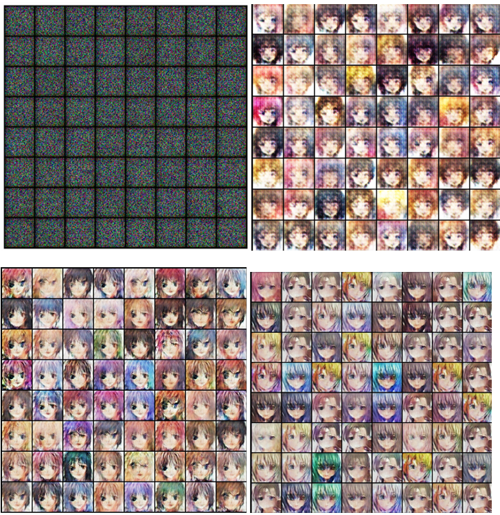

# GAN Anime Faces

This project implements a Generative Adversarial Network (GAN) to generate anime face images using the Anime Face Dataset. The model is trained using PyTorch and progressively generates better quality images after each epoch.

---

## Results

- Generated sample images are saved in the `generated` folder with filenames like `generated-images-0000.png`.
- Example generated image:

  

- You can view the training progression as a video saved as `gans_training.avi`.
---

## Usage

- Run the notebook or Python script.
- The dataset will be downloaded automatically.
- The model will start training, displaying sample generated images after each epoch.
- Generated images will be saved in the `generated` directory.
- After training, a video `gans_training.avi` will be created to visualize the image progression.

---

## Model Architecture

### Discriminator
- A convolutional neural network that takes 64x64 RGB images as input.
- Outputs a probability of the image being real or fake.
- Uses Conv2d layers, BatchNorm, LeakyReLU activations, and Sigmoid output.

### Generator
- A transposed convolutional neural network that takes random noise vectors as input.
- Generates 64x64 RGB images.
- Uses ConvTranspose2d layers, BatchNorm, ReLU activations, and Tanh output.

---

## Training Details

- **Loss function:** Binary Cross Entropy (BCE) for both Generator and Discriminator.
- **Optimizer:** Adam with learning rate 0.0002 and betas (0.5, 0.999).
- **Batch size:** 128
- **Image size:** 64x64
- **Latent vector size:** 128
- **Number of epochs:** Configurable (default 5)

---

## License

This project is open source and available under the MIT License.

---

## Acknowledgments

- Dataset from [splcher/animefacedataset](https://www.kaggle.com/datasets/splcher/animefacedataset)
- PyTorch official DCGAN tutorial inspired the architecture and training approach.

---

Feel free to open issues or submit pull requests for improvements!
